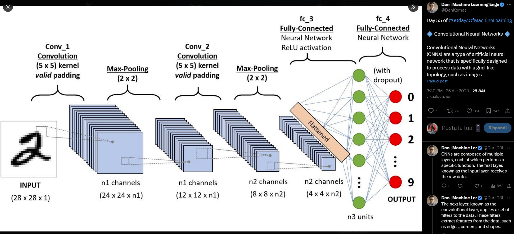

# TITLE
## sub title
### xxxx


# Lists

Here's a unordered list:

   -  Item 1 
   -  Item 2 
   -  Item 3 

Ordered list is here:

   1.  Item A 
   1.  Item B 
   1.  Item C 

# Font Styles

Here are the complete list of font styles available in Live Editor: **Bold**, *Italic*, Underline, `Equispace`. And its conbinations:

***BoldItalic***, **BoldUnderline**, **`BoldEquispace`**, *ItalicUnderline*, *`ItalicEquispace`*, `UnderlineEquispace`, ***BoldItalicUnderline***, ***`BoldItalicEquispace`***, **`BoldUnderlineEquispace`**, *`ItalicUnderlineEquispace`*

Here we neglect the underline.

# Quotation

There's not corresponding function, but here centered paragraph is treated as quotation.

> There's not corresponding function, but here centered paragraph is treated as quotation.


# Symbolic Math Example

Copyright 2020 The MathWorks, Inc.

```matlab:Code
syms theta
f = sin(theta)
```

f = 

  
$$
 \sin \left(\theta \right)
$$




